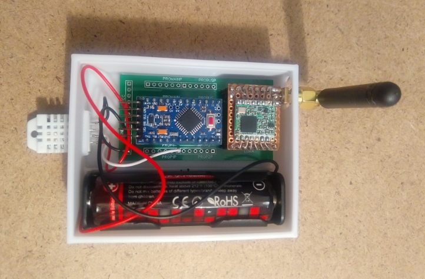
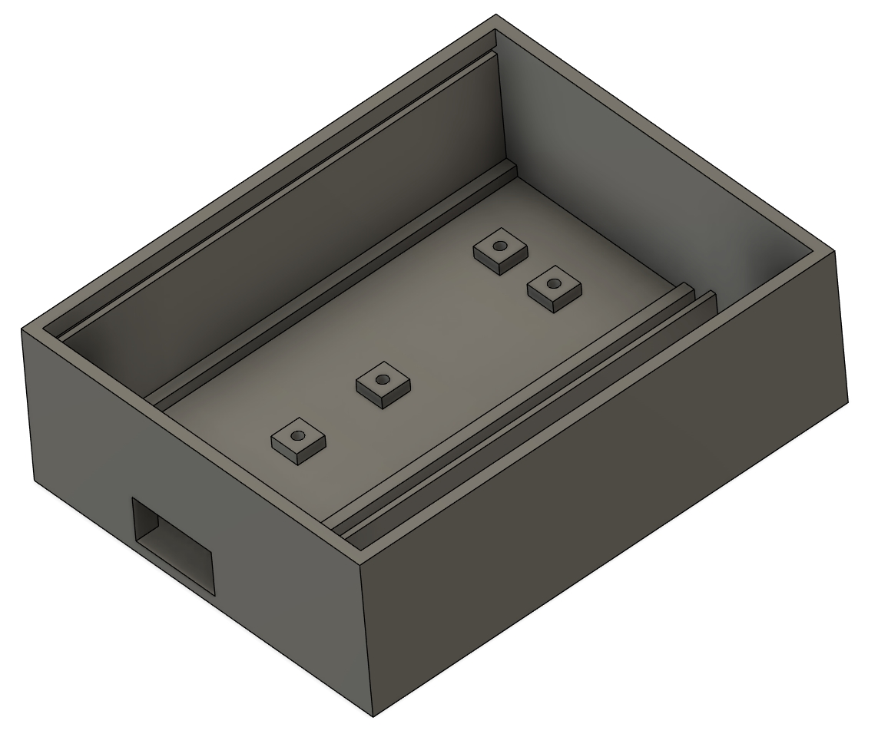

# Arduino Pro Mini TTN LoRaWAN Door Switch node (Alarm System)

`Arduino Pro Mini` TTN LoRaWAN Node with `DoorSwitch` and `SX1276` Lora module.
The Arduino was converted to [LowPower](https://jackgruber.github.io/2019-12-27-Low-power-Arduino-Pro-Mini/) by desoldering the power LED and the voltage converter.

## Case

## TTN payload decoder (v3)

see payload_formatter folder